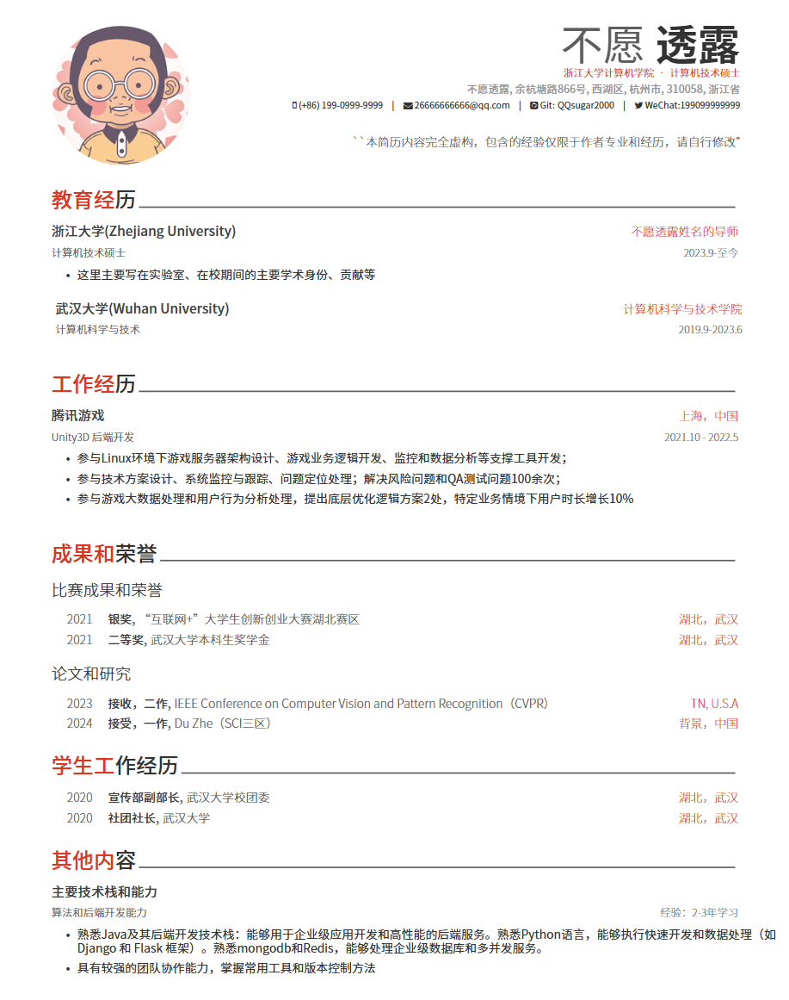
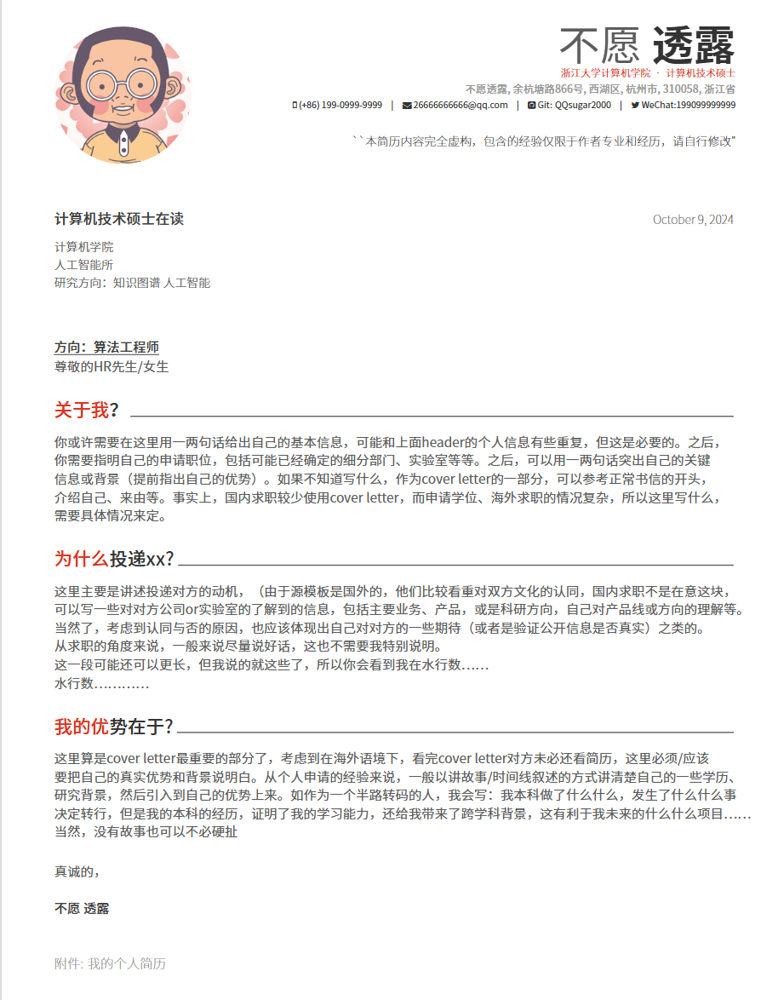

# 项目由来
美观、简约风格的个人简历latex模板（包括coverletter模板），fork自Awesome CV项目。

苦于中文简历模板要么需要付费下载、要么可编辑性差（word版本，或者是超级简历那种）；因此找了一圈Github上的latex简历模板，发现大多数不是很美观
[Awesome-CV项目](https://github.com "GitHub - Where the world builds software together")比较简约美观，但是是英文的。
本项目对其进行了中文本地化，将字体替换成了思源黑，并将一些表达方式替换成了国内的表达习惯
现在，你可以直接在latex编译器中运行这个项目
# 预览和效果
简历模板预览效果如下：

    
    

# 使用方法
下载release中的zip文件,上传到overleaf并使用即可
或者你也可以使用本地latex编译器
注意，必须主动在overleaf的设置中，设置编译器为XeLatex(左边menu-settings）

# Project Fork and Modifications

This project is based on the original work from [Original Author Name](https://github.com/originalauthor) and their repository [Original Project](https://github.com/originalproject).

Modifications made by [Your Name](https://github.com/qqsugar2020):
- Added feature X
- Improved performance in area Y
- Updated Chinese language support

The project continues to be licensed under the [original license] included in this repository.
